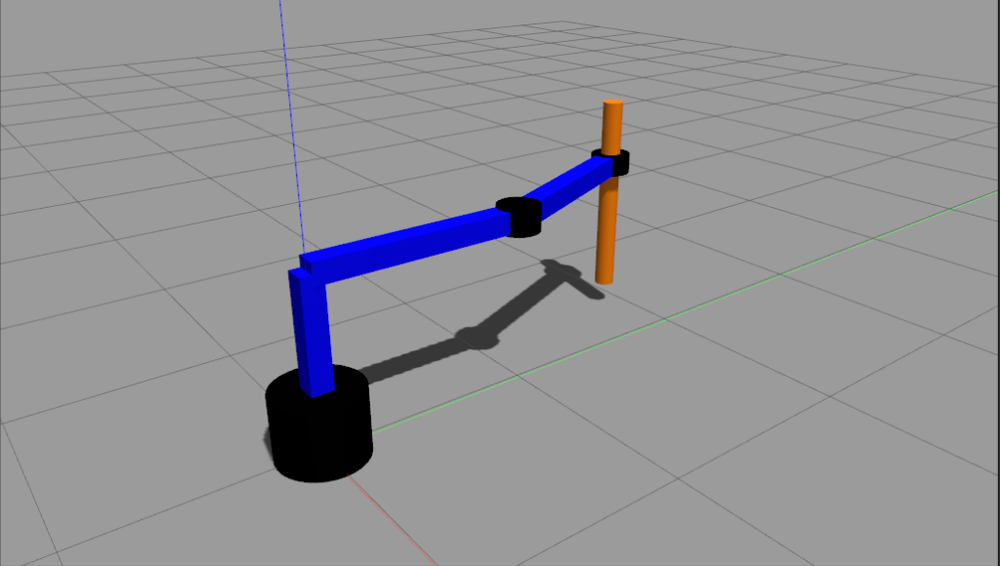

# Kinematics of Scara Robot

[](https://github.com/aniketmpatil/scara_robot/actions/workflows/noetic.yml)

 

## Requirements:

1. Ubuntu with ROS Noetic
2. Gazebo Simulator
3. [ros_control](http://wiki.ros.org/ros_control) package
    ```
    sudo apt-get install ros-noetic-ros-control ros-noetic-ros-controllers
    ```

## How to run the code?

First clone the repository into a `src` folder of a ROS workspace and perform catkin_make operation. Use the source command:
  ```
  source devel/setup.bash
  ```

> IMPORTANT: You will need to use this command in every new terminal you open, or you can add it to your .bashrc file

1. ### Using a URDF to spawn the SCARA robot
    To spawn the scara robot in ROS-Gazebo environment, use the roslaunch command: 
    ```
    roslaunch scara_robot my_env.launch
    ```

2. ### Forward Kinematics Implementation
    #### (Subscriber - Publisher model)
    The forward kinematics node subscribes to the topic */scara_robot/joint_states* through which it receives the joint values of robot from gazebo. Then these three joint values are used to calculate the end effector pose using forward kinematics and then is published on the topic */scara_robot/output_pose*.

    In a new terminal run the command to run the forward kinematics node:
    ```
    rosrun scara_robot scara_forward
    ```

    ---
    In a new terminal run the following command to observe the Pose of the End Effector (output from the forward kinematics node):
    ```
    rostopic echo /scara_robot/output_pose
    ```

    In the output, we only observe the end effector position, that is, the x, y and z values.

    ---
    In another terminal run the command to publish new values to the joints:

    ```
    rostopic pub /scara_robot/joint1_position_controller/command std_msgs/Float64 "data: 0.78"
    ```
    Here, we can change the controller from joint1_position_controller to joint2_position_controller.

    ---
3. ### Inverse Kinematics Implementation
    #### (Service Client model)
    The server file takes the pose values using geometry_msgs/Pose message type. Then server takes the position x, y and z values from Pose.position object and calculates the three joint variables joint1, joint2 and joint3 using inverse kinematics. Then the server file prints the joint state response using sensor_msgs/JointState message type. 

    In a new terminal window, run the command to run the server node:
    ```
    rosrun scara_robot server.py
    ```

    In another terminal run the command to publish new values to the joints (with the forward kinematics running):

    ```
    rosservice call /inv
    ```
    and then use tab completion to get the standard message format, in which you can enter end effector positions.

    Example (do not copy-paste): 
    ```
    rosservice call /inv "pose: position: x: 0.0 y: 0.0 z: 0.0 orientation: x: 0.0 y: 0.0 z: 0.0 w: 0.0"
    ```
    
    ---

4. Tuning the PID Position Controllers for each joint

    The [tuner.py](./scripts/tuner.py) script will subscribe values from the Joint State Publisher and clock topic from Gazebo and plot these values. This script can be run for each joint, by changing the publisher. 

    > Important: When tuning one joint, change the Xacro file to convert other two joints to "fixed" state

    The P, I and D values can be changed in the [robot_config.yaml](./config/robot_config.yaml) file.

    The position controllers for all 3 joints have also been added to the launch file, to spawn them during the launch.

    ---

